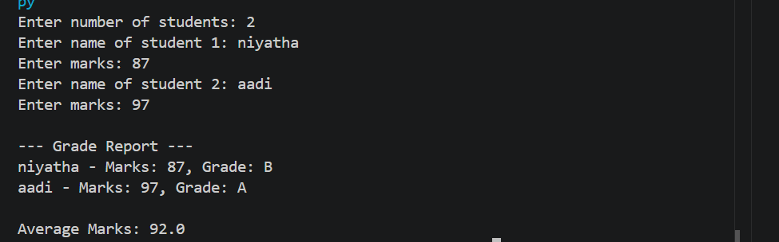

# Student Grade Analyzer

## Problem Statement

Develop a Python program to analyze student marks and generate performance insights.

## Features

* Add student details dynamically
* Calculate grades based on marks
* Display individual student performance
* Calculate average marks
* Simple and user-friendly console interface

---

## Technologies Used

* Python
* Lists & Tuples
* Loops & Conditional Statements
* Basic Input/Output

---

## How to Run

1. Open VS Code or any Python IDE
2. Create a file `grade_analyzer.py`
3. Paste the code
4. Run using:

   ```
   python grade_analyzer.py
   ```

---

## Output Screenshots

<div align="center">



<br><br>

</div>

---
